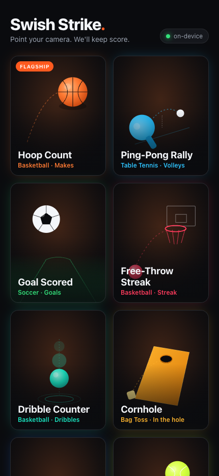
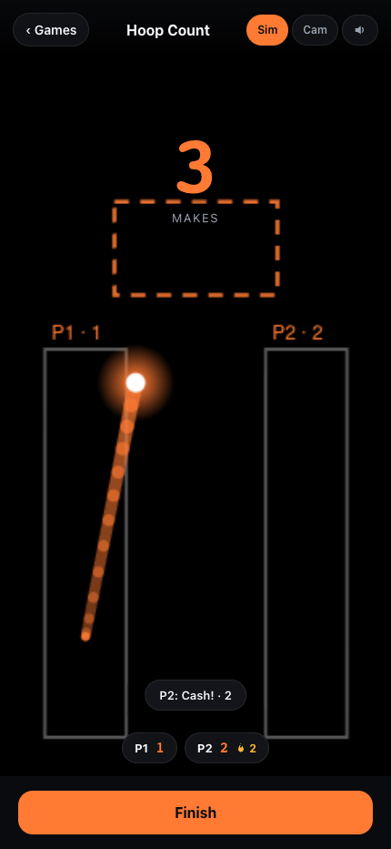
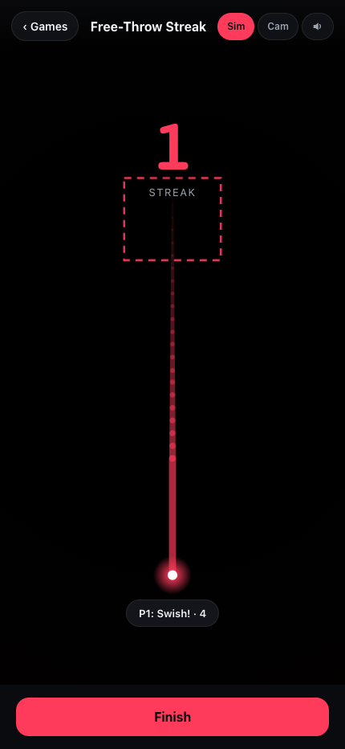
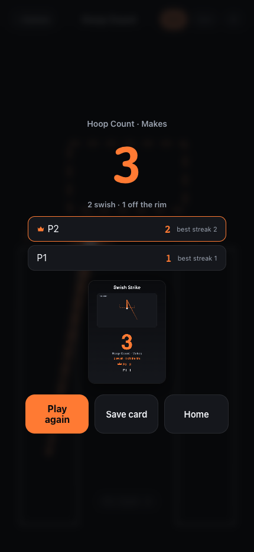
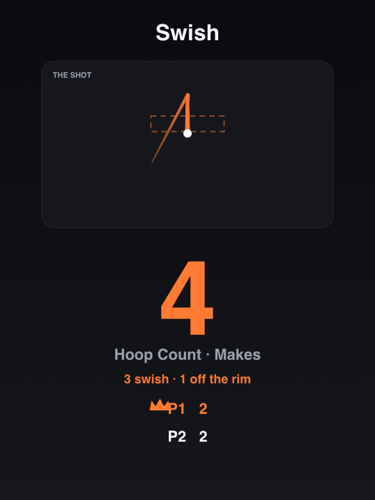
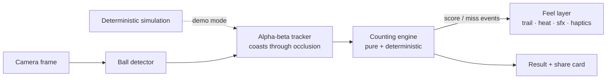

# Swish Strike

**Point your camera at a ball game. It keeps score. Entirely on-device.**

Swish Strike watches a ball through the camera and counts scoring events in real time —
basketball makes (and whether they *swished* or rattled in), free-throw streaks,
soccer goals, juggling touches, and ten more games. No account, no upload, no
analytics, no network in the counting path.

[](https://github.com/binnukarunakar/swish-strike/actions/workflows/ci.yml)


| Home | Live play | Free-throw streak | Result + share card |
|---|---|---|---|
|  |  |  |  |

## What it does

- **Counts automatically.** A made basket is the ball falling down through the
  rim zone; a juggle touch is an amplitude-gated bounce reversal. Fourteen games
  ship, each a tuned configuration of two counting rules.
- **Knows a swish from a rattle.** Each basketball make is classified from where
  it crossed the rim and whether it popped up off the iron — different callout,
  ring color, sound, and haptic for each.
- **Scores streaks with real misses.** Free-Throw Streak detects a shot that was
  aimed at the rim and fell past it, and resets the count — one miss, back to zero.
- **Feels alive.** A comet trail traces the ball, the screen warms as you score
  in rhythm ("ON FIRE"), and every sound is synthesized at runtime — the repo
  ships zero audio or image assets.
- **Shares the moment.** The result screen renders a share card with the actual
  arc of your last make drawn through the hoop.



## How it works



**One engine, two languages, provably identical.** The counting engine is a pure
function: a stream of normalized ball positions in, score events out. It exists
twice — Swift (`ios/SwishStrikeCore`) for the app, JavaScript (`web-prototype`) for the
browser — and a shared golden trace is replayed through both on every test run.
If the two ever disagree on a single count, the build fails.

**Three counting rules.**

| Rule | Fires when | Games |
|---|---|---|
| `zoneCrossDown` | the ball, seen above the target and aligned, crosses down through it | basketball, soccer, cornhole, golf, cup pong |
| `zoneStreak` | same make detection, but a shot that falls past the rim without scoring **resets the count to zero** | free-throw streak |
| `bounceReversal` | amplitude-gated oscillation extremes (jitter can't inflate the count) | juggling, dribble, rallies, catch, bottle flip |

**Shot quality is metadata, not a rule change.** A make is labeled `swish`
(center-half crossing, monotonic drop) or `rim` (off-center, or a pop-up off the
iron mid-descent). The label never affects *whether* a basket counts, so the
cross-language parity proof stays exact while the experience differentiates.

**Detection.**
- **iOS:** Apple Vision's `VNDetectTrajectoriesRequest` — purpose-built,
  on-device detection of thrown/bouncing balls. No model to train, bundle, or
  download. A `BallDetecting` protocol leaves room for a custom Core ML model later.
- **Web:** a hybrid detector (HSV color + frame-difference motion + COCO-SSD)
  with MoveNet multi-pose for per-player attribution — all vendored locally.
- **Both:** a deterministic simulation drives the entire experience with zero
  camera/model, which is why the full flow is testable headlessly and the app
  works in the iOS Simulator.

**The engine is hardened** against real detector behavior: out-of-order and
duplicate frames are dropped, NaN/Inf coordinates are treated as misses, a long
detection gap resets the track so no phantom crossing is synthesized across an
occlusion, and degenerate zones never fire.

## Quick start — web (30 seconds)

```sh
cd web-prototype
python3 -m http.server 8777
# open http://localhost:8777 and pick a game — the on-device demo starts immediately
```

## Build the iOS app

Requires Xcode 16+ on macOS.

```sh
open ios/SwishStrikeApp/SwishStrike.xcodeproj      # open, select a team, run
```

- Set your bundle identifier and signing team (defaults: `com.binnu.swishstrike`,
  automatic signing).
- In the **Simulator** the app runs in Demo mode (deterministic simulation).
  On a **device**, grant camera access and point it at a hoop.
- If your Xcode version rejects the committed project:
  `brew install xcodegen && make xcodeproj`.

`ios/SwishStrikeCore` — the engine, catalog, tracker, simulation, and feel-layer
logic — is a plain SwiftPM package that builds and tests on any Mac **without
Xcode** (`make core-check parity`).

## Testing

Every behavior claim above is executable:

| Command | What it proves |
|---|---|
| `make web-test` | JS engine, rules, shot quality, streak+miss pipeline swept from 60 → 5 fps with timing jitter |
| `make core-check` | Swift engine headless checks (same behaviors, no Xcode needed) |
| `make parity` | the golden trace replays identically through **both** engines |
| `make serve` + `make web-ui` | the full flow in real Chrome: setup → play → result, swish *and* rim observed, a miss resets the streak, zero console errors |
| `make typecheck` | best-effort macOS typecheck of the iOS app sources |
| CI (`.github/workflows/ci.yml`) | all of the above plus an iOS Simulator build on every push |

## Project structure

```
ios/
  SwishStrikeCore/   pure logic: engine, catalog, tracker, sim, feel layer — SwiftPM, tested
  SwishStrikeApp/    thin platform layer: camera, Vision, SwiftUI, audio, haptics
web-prototype/       runnable browser implementation sharing the same engine (JS mirror)
assets/              generated hero art + screenshots (no licensed media anywhere)
tools/               icon generator, typecheck harness
```

## Privacy

Everything runs on the device. No frame, detection, or score leaves it. No
account, no ads, no analytics SDK, no tracking — the iOS privacy manifest
declares nothing because there is nothing to declare. The only optional network
call anywhere is the web prototype's one-time model download if you opt into its
camera mode.

## License

[MIT](LICENSE)
